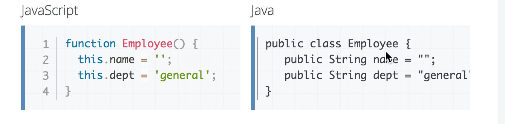
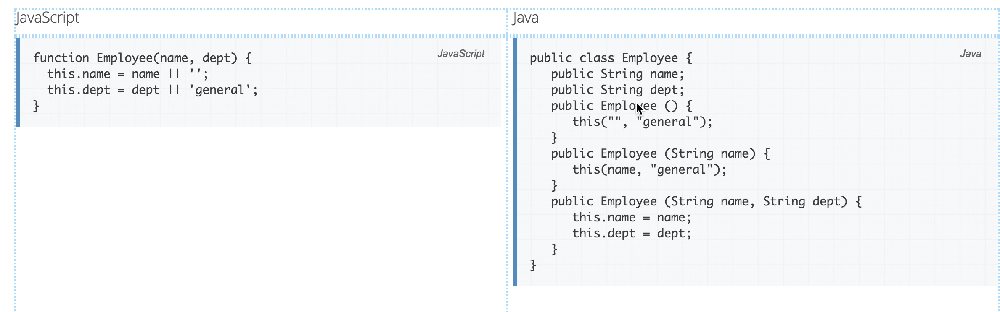

## 对象 原型实践

问题1： OOP 指什么？有哪些特性

object oriented programming <===> 面向过程编程
OOP是一种编程模式，这种编程模式将数据封装成对象，采用操作对象的形式来编程。
JS是一种非常注重OOP的语言，它遵循prototype的方式而不是传统C系语言的class模型。

[OOP官方解释](https://developer.mozilla.org/en-US/docs/Glossary/OOP)

class 【类】 ==> 创建实例 new 

prototype  +  构造函数 ==> 实例


1. class定义抽象的数据模型，实例instance由类class实例化，和class具备相同的数据结构[不多也不少]。

2. JS没有类和实例的明显区分。
它只有`object`对象。一个原型继承的语言有prototype`原型对象`的概念.
`prototype`是新对象创建时候的模板对象(template object)。
一个对象可以随意控制自己的`property`方式。

[面向对象采用class和prototype的区别](https://developer.mozilla.org/en-US/docs/Web/JavaScript/Guide/Details_of_the_Object_Model#Class-based_vs._prototype-based_languages)





特性


1. Encapsulation 封装==> `private 、public method`等等
2. Composition, inheritance, and delegation (组合、继承、代理) ==> `extends 、protoptye`
3. Polymorphism (多态) ==> `apple.eat() 、 banana.eat()`
4. Open recursion (使用同一个对象的其他方法)==>`this self等`

[wikipedia oop](https://en.wikipedia.org/wiki/Object-oriented_programming)


问题2： 如何通过构造函数的方式创建一个拥有属性和方法的对象? 

```js

	function Person(name,age){
	  this.name = name;
	  this.age = age
	}
	Person.prototype.slogan = function(){
	  console.log('My name is : ' + this.name);
	}
	var p = new Person('liyang',18);
	p.slogan();

```
问题3： prototype 是什么？有什么特性 

> Every JavaScript object has a prototype. 
  The prototype is also an object. 
  All JavaScript objects inherit their properties and methods from their prototype.

每一个JS对象都有原型。
原型是一个对象。
所有的JS对象都从原型里继承属性和方法。  

1. 字面量创建对象的原型链

```js
	var o = {a: 1};
	//原型链 o ---> Object.prototype ---> null

	var b = ['yo', 'whadup', '?'];
	//原型链 b ---> Array.prototype ---> Object.prototype ---> null

	function f() {
	  return 2;
	}
	//原型链 f ---> Function.prototype ---> Object.prototype ---> null

```

2. With a constructor

```js
	var Test = function(){
        this.name = 'slashhuang'
    };
    Test.prototype = {
        bark: function() {
           alert(this.name)
         }
    };
    var inst = new Test()

	// inst is an object with own property 'name'.
	// inst的原型is the value of Test.prototype when new Test() is executed.

```

3. With Object.create //ES5

```js
	var a = {a: 1}; 
	// a ---> Object.prototype ---> null

	var b = Object.create(a);
	// b ---> a ---> Object.prototype ---> null
	console.log(b.a); // 1 (inherited)

	var c = Object.create(b);
	// c ---> b ---> a ---> Object.prototype ---> null

	var d = Object.create(null);
	// d ---> null
	console.log(d.hasOwnProperty); 
	// undefined, because d doesn't inherit from Object.prototype

```

4. With the class keyword ==> ES6 prototype

```js
	class Polygon {
	  constructor(height, width) {
	    this.height = height;
	    this.width = width;
	  }
	}

	class Square extends Polygon {
	  constructor(sideLength) {
	    super(sideLength, sideLength);
	  }
	  get area() {
	    return this.height * this.width;
	  }
	  set sideLength(newLength) {
	    this.height = newLength;
	    this.width = newLength;
	  }
	}

	var square = new Square(2);

```


问题4：画出如下代码的原型图

```js
	function People (name){
	  this.name = name;
	  this.sayName = function(){
	    console.log('my name is:' + this.name);
	  }
	}

	People.prototype.walk = function(){
	  console.log(this.name + ' is walking');  
	}

	var p1 = new People('饥人谷');
	var p2 = new People('前端');
```
	// p1 ---> People.prototype ---> Object.prototype ---> null
	// p2 ---> People.prototype ---> Object.prototype ---> null


问题5： 创建一个 Car 对象，拥有属性name、color、status；
	拥有方法run，stop，getStatus 

	//设置自有属性
	var Car  = function(name,color,status) {
		this.name = name;
		this.color = color;
		this.status = status;
	};
	//模板属性
	Car.prototype =  {
		run:function(argument) {
			console.log(this.name+'is running')
		},
		stop:function(argument) {
			console.log(this.name+'is stpped')
		},
		getStatus:function(argument) {
			console.log(this.name+'is nice')
		}
	};
	var car = new Car('benz','red','good')


问题6： 创建一个 GoTop 对象，当 new 一个 GotTop 对象则会在页面上创建一个回到顶部的元素，点击页面滚动到顶部。拥有以下属性和方法

```bash

	1. `ct`属性，GoTop 对应的 DOM 元素的容器
	2. `target`属性， GoTop 对应的 DOM 元素
	3. `bindEvent` 方法， 用于绑定事件
	4  `createNode` 方法， 用于在容器内创建节点

```


问题列表
1. 	this有点晕。还有就是原型链的尽头是什么？

|- new constructor() ===> this指向生成对象
|- 方法调用 {a:1,b:function(){this.a}} ===>this指向方法调用方
|- 函数调用 var s = function(){this.a } ===>this指向全局对象
|- apply/call调用 s.apply({a:1})  ===> this指向第一个参数

2.  没什么具体要问的，因为都不明白，不过今天要讲的课，应该能让我理清头绪

3.  为什么会出现JS面向对象以及后面的那些编程方式	

4.  日常工作中是如何使用 js 面向对象的方式编程的呢？

5.  希望老师能讲个例子，说说实际工作中是面向对象编程的经验

6.  将方法写到原型上的主要作用是用于继承吗	

7.  讲讲模块化开发，如何设计一个模块	 //**//
8.  学的比较浅，只了解写皮毛	
9.  面试中如果问到面向对象，回答到什么程度才算答出这个问题	


